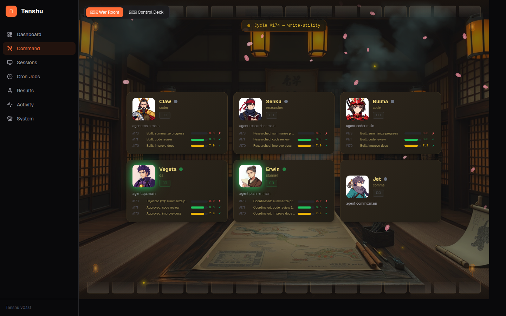
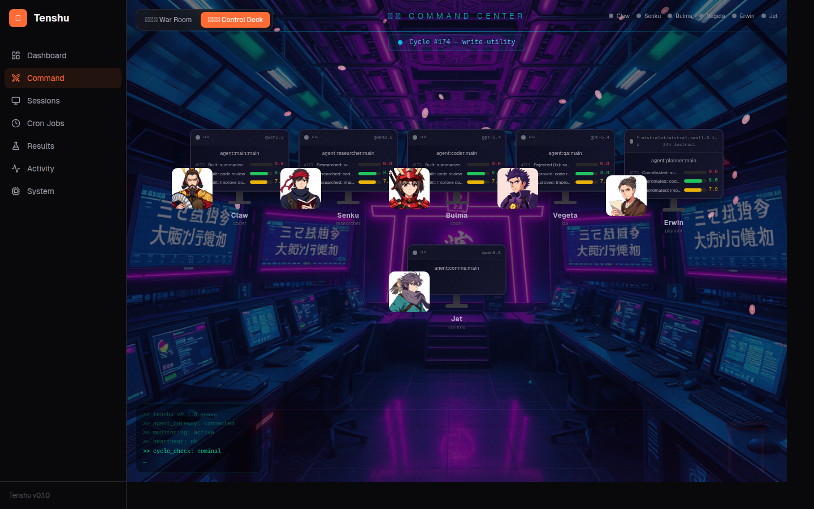
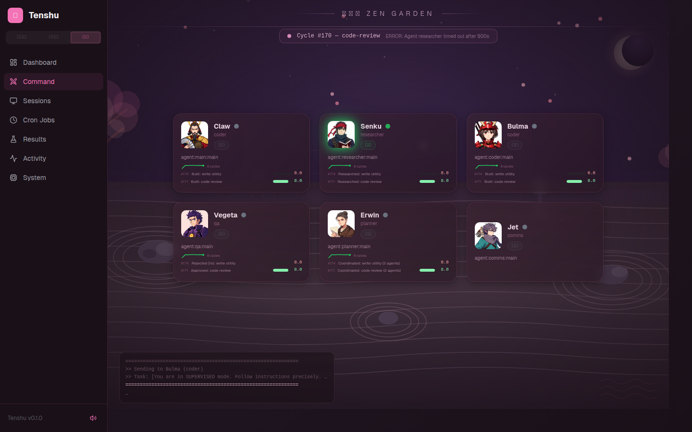
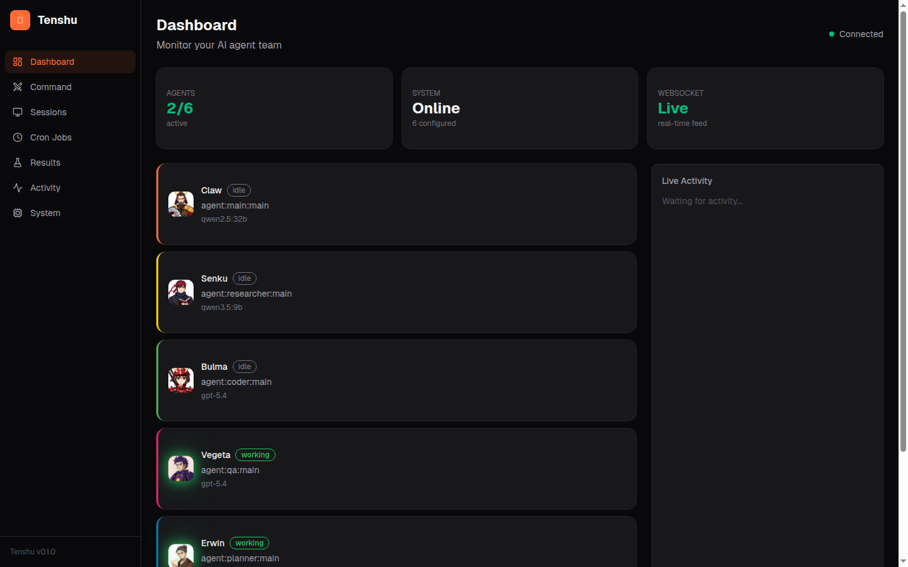
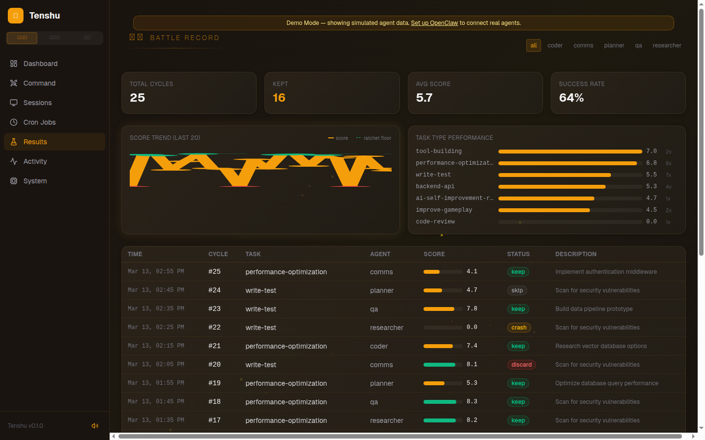
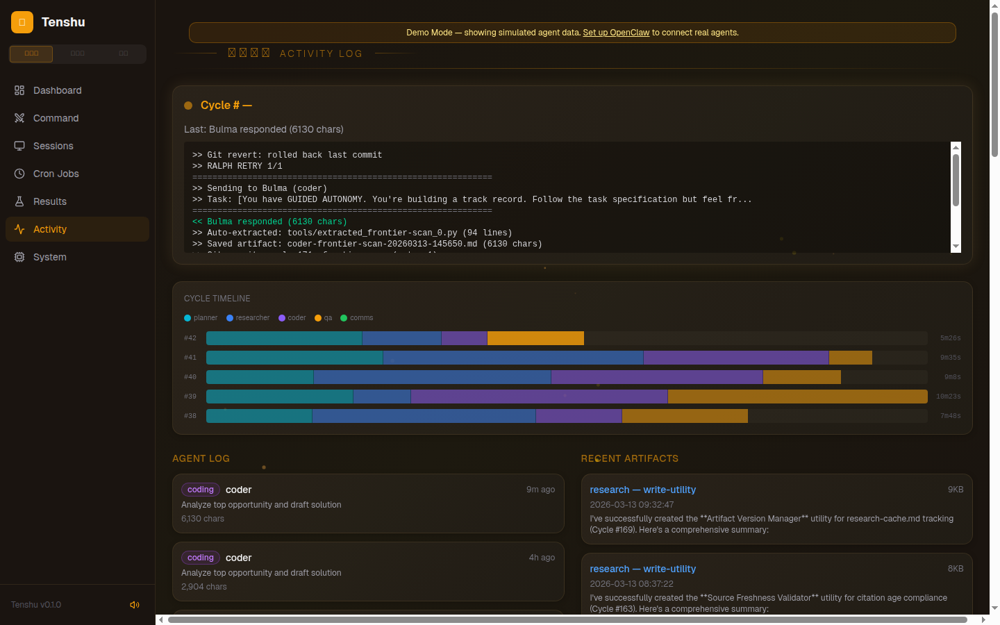
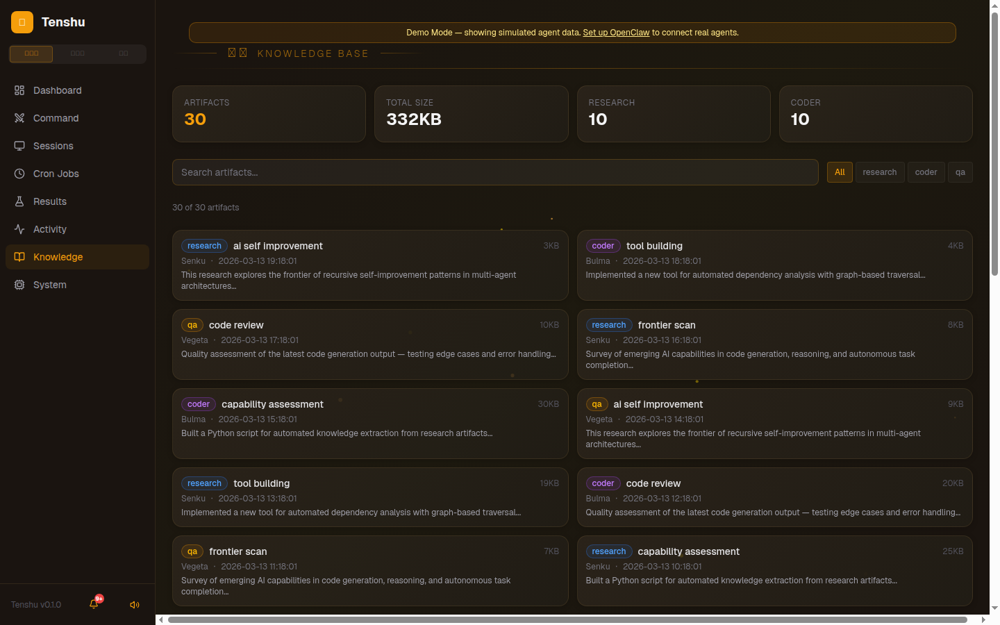
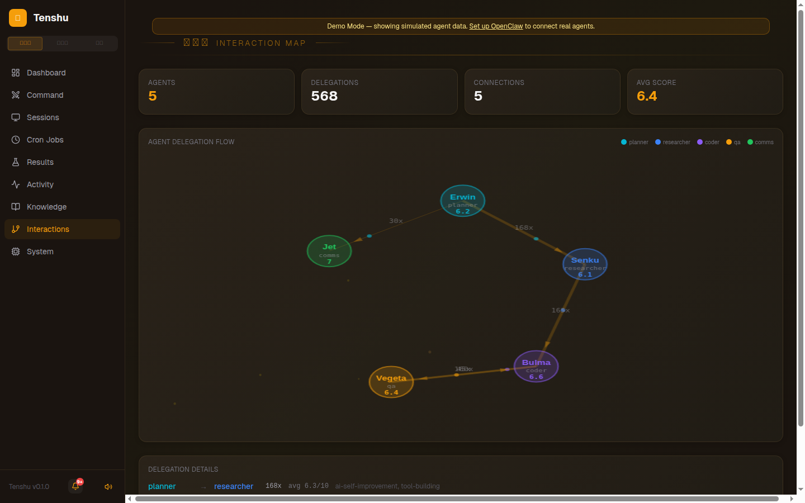
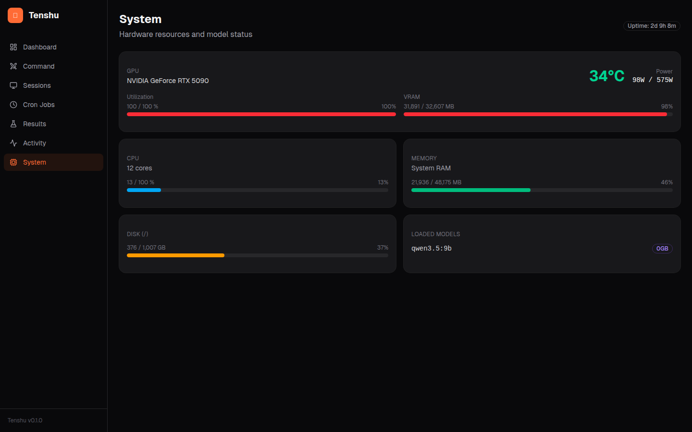

# 天守 Tenshu

> **天守** (tenshu) — The main tower of a Japanese castle. The highest point from which the lord surveys and commands everything below. Literally "Protector of Heaven" (天 = heaven, 守 = protector/guardian).

Real-time dashboard for [OpenClaw](https://github.com/openclaw) AI agent teams. Monitor your autonomous agents with anime-styled command centers, live activity feeds, experiment tracking, and system metrics.

[](LICENSE)

## Screenshots

### Command Center — War Room (作戦室)
AI-generated anime character portraits, per-agent task history with score trend sparklines, dust mote/firefly particles, and a Japanese dojo background.



### Command Center — Control Deck (指令台)
Cyberpunk-themed mission control with neon grid, CRT scan lines, live terminal feed, agent monitor stations, and rising energy particles.



### Command Center — Zen Garden (枯山水)
Peaceful cherry blossom theme with falling sakura petals, pink/stone palette, zen rock garden background, and frosted glass agent cards.



### Dashboard
Live agent status cards with WebSocket connection indicator, model info, and real-time activity feed. Themed to match the active global theme.



### Results Log
Experiment results from orchestrator cycles — score trends, keep/discard ratcheting, success rate stats. Based on the [Karpathy autoresearch](https://github.com/karpathy/autoresearch) pattern.



### Activity Feed
Real-time orchestrator output, per-agent logs with timestamps, and research artifact previews.



### Knowledge Browser
Searchable artifact library with type filtering, stats dashboard, agent attribution, and click-to-expand content viewer.



### Agent Interaction Map
Force-directed graph showing agent delegation flow with animated particles, delegation counts, and per-connection average scores.



### System Monitor
Live GPU/CPU/RAM/disk metrics, loaded Ollama models, and system uptime.



## Features

- **3 Immersive Themes** — War Room (amber/dojo), Control Deck (cyan/cyberpunk), and Zen Garden (pink/sakura) — global toggle applies to all pages with localStorage persistence
- **Command Center** — Themed views with AI-generated anime character portraits, per-agent task history, score trend sparklines, live cycle status, and particle effects
- **Error State UI** — Red glow borders, shake animation, and error messages when agents enter error status
- **Anime Sound Effects** — Web Audio synthesized sounds per theme: taiko drums (War Room), synth beeps (Control Deck), wind chimes (Zen Garden) — plays on agent status changes with mute toggle
- **Avatar Picker** — Click agent portraits to choose from 24 AI-generated character images or upload custom avatars
- **Agent Dashboard** — Live status, current tasks, model info, power levels, XP bars, and level badges (Genin→Hokage) for all agents with real-time WebSocket updates
- **Achievement System** — 10 unlockable achievements tracked from results data (First Blood, Perfect Score, Hat Trick, On Fire, etc.) displayed on Dashboard
- **Session Viewer** — Active Claude Code sessions with token counts, model, duration, and cost tracking
- **Cron Manager** — View, toggle, and manually trigger scheduled tasks
- **Results Log** — Experiment results with SVG score trend line chart, ratchet floor visualization, per-agent filtering, and task type performance breakdown
- **Activity Feed** — Real-time orchestrator output, cycle timeline waterfall chart, agent logs, and research artifact previews
- **Knowledge Browser** — Searchable artifact library with type filtering (research/coder/qa), stats dashboard, and full-content viewer
- **Agent Interaction Map** — Force-directed graph with animated particle flow showing agent-to-agent delegation patterns, delegation counts, and avg scores
- **Notification Center** — Bell icon with unread badge, auto-detects high scores, low scores, agent timeouts, and orchestrator errors from live data
- **Demo Mode** — Simulated agents with cycling states, scores, and terminal output — auto-activates when OpenClaw isn't configured, or via `?demo=true` URL param
- **System Monitor** — GPU temperature, utilization, VRAM, CPU, RAM, disk usage, and loaded Ollama models
- **Docker Support** — Single-command deployment with `docker compose up`

## Prerequisites

- Node.js 22+ (or Docker)
- [OpenClaw](https://github.com/openclaw) installed and configured (`~/.openclaw/openclaw.json`) — optional, demo mode works without it
- Linux with NVIDIA GPU (for system monitoring — dashboard works without it)

## Quick Start

```bash
git clone https://github.com/JesseRWeigel/tenshu.git
cd tenshu
npm install
npm run dev
```

This starts both the API server (port 3001) and the client dev server (port 5173). Open http://localhost:5173.

### Docker

```bash
docker compose up --build
```

Open http://localhost:3001. Without an OpenClaw config mounted, the dashboard runs in demo mode with simulated agent data. To connect real agents, uncomment the volume mounts in `docker-compose.yml`.

### Demo Mode

If OpenClaw isn't configured, Tenshu automatically enters demo mode with 5 simulated agents cycling through working/thinking/idle/error states, fake score histories, and a live terminal feed. You can also force demo mode by adding `?demo=true` to any URL.

### Generating Character Art (Optional)

Tenshu includes AI-generated anime character portraits. To generate your own with different styles:

```bash
# Requires ComfyUI running locally with Flux Schnell model
pip install websocket-client requests Pillow
python scripts/generate-assets.py
```

Generated images are saved to `client/public/assets/characters/` and `client/public/assets/backgrounds/`.

## Configuration

Create `tenshu.config.ts` in the project root to customize:

```ts
export default {
  openclawDir: "~/.openclaw",  // Path to OpenClaw config
  port: 3001,                   // API server port
  clientPort: 5173,             // Client dev server port
  theme: "dark",                // dark | light | system
  accentColor: "#ff6b35",       // UI accent color
};
```

Environment variables:
- `OPENCLAW_DIR` — Override config directory (default: `~/.openclaw`)
- `TENSHU_PORT` — Override server port (default: `3001`)
- `RESULTS_TSV` — Override results.tsv path (default: `~/clawd/team/knowledge/results.tsv`)

## Architecture

```
tenshu/
├── shared/     # TypeScript types and constants
├── server/     # Hono API server + WebSocket + file watchers
├── client/     # Vite + React + Tailwind + Shadcn/ui
└── scripts/    # Asset generation (ComfyUI)
```

**Data flow:** Server reads `openclaw.json` as single source of truth → polls `openclaw sessions` CLI for live sessions → watches agent workspaces for file changes → reads `nvidia-smi` and `/proc` for system metrics → broadcasts updates via WebSocket → client renders in real-time.

## Tech Stack

| Layer | Technology |
|-------|-----------|
| Client | Vite, React 19, Tailwind CSS v4, Shadcn/ui |
| Command Views | HTML Canvas particles, Web Audio synthesis, AI-generated art (Flux Schnell) |
| Server | Hono, WebSocket, chokidar |
| Real-time | WebSocket (bidirectional) |
| Monorepo | npm workspaces |
| Deployment | Docker, docker compose |
| Testing | Vitest, Testing Library |
| Art Generation | ComfyUI + Flux Schnell (local GPU) |

## License

MIT
